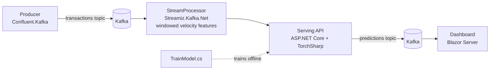

# Real-Time Fraud Detection Pipeline — .NET / C# Edition

A C#/.NET rewrite of the fraud-detection pipeline: transactions flow through
Kafka, get windowed/aggregated by a Kafka Streams-style topology, are scored
by a TorchSharp (native .NET PyTorch bindings) model served via ASP.NET Core,
and displayed live in a Blazor Server dashboard.

## A note on Spark and Flink

This is the one place a direct 1:1 port isn't honestly possible:

- **Apache Spark**: `.NET for Apache Spark` (Microsoft.Spark) exists but has
  been effectively unmaintained since ~2022, and its Structured Streaming
  support was always limited. Using it here would mean shipping something
  that doesn't reflect how Spark is actually run anywhere in production.
- **Apache Flink**: has no .NET API at all — Java, Scala, and Python only.

**What this repo uses instead:** [Streamiz.Kafka.Net](https://github.com/LGouellec/kafka-streams-dotnet),
an actively maintained .NET port of the Kafka Streams topology API. It's the
idiomatic .NET-native way to do stateful stream processing on Kafka —
windowed aggregations, state stores, the same conceptual vocabulary
(tumbling/hopping windows, exactly-once) you'd use to discuss Spark or Flink
in an interview, just running on a different engine. If this comes up in a
conversation, "Spark/Flink don't have real .NET support, so I used the
Kafka Streams equivalent" is an honest, judgment-showing answer — better
than pretending an unmaintained binding is production-viable.

## Architecture



## Repo layout

```
fraud-detection-dotnet/
├── FraudDetection.sln
├── Producer/            # Confluent.Kafka producer simulating transactions
├── Model/               # TorchSharp model definition + offline training (TrainModel.cs)
├── StreamProcessor/      # Streamiz.Kafka.Net topology (Spark/Flink equivalent)
├── Serving/              # ASP.NET Core Minimal API serving the TorchSharp model
├── Dashboard/            # Blazor Server live dashboard
├── infra/
│   ├── k8s/               # Strimzi Kafka manifests, serving Deployment + HPA
│   └── terraform/         # AKS cluster provisioning stub
└── data/                  # Place Kaggle creditcard.csv here (not committed)
```

## Library choices and why

| Concern | Library | Notes |
|---|---|---|
| Kafka producer/consumer | `Confluent.Kafka` | Official, actively maintained, arguably cleaner API than the Python client |
| ML model | `TorchSharp` | Real .NET Foundation bindings to libtorch — the same engine PyTorch itself uses, not a reimplementation like ML.NET |
| Stream processing | `Streamiz.Kafka.Net` | Kafka Streams topology API ported to .NET; stands in for Spark/Flink |
| Serving | ASP.NET Core Minimal API | Native, no framework needed beyond the SDK |
| Dashboard | Blazor Server | Native .NET UI framework; polls an in-memory store fed by a background Kafka consumer |
| CSV parsing (training) | `CsvHelper` | Standard for reading the Kaggle dataset |

**One alternative worth knowing about:** if the team you're interviewing
with is invested in ML.NET rather than TorchSharp, that's a fair swap — but
ML.NET's neural network story is thinner and less flexible than TorchSharp
for this kind of custom architecture. TorchSharp is the closer match to
"I know PyTorch," which is likely the more valuable signal to send.

## Local quickstart

1. **Spin up Kafka + Zookeeper + Redis:**
   ```bash
   docker-compose up -d
   ```

2. **Get training data:** download the [Kaggle Credit Card Fraud dataset](
   https://www.kaggle.com/mlg-ulb/creditcardfraud) into `data/creditcard.csv`.

3. **Train the model:**
   ```bash
   dotnet run --project Model -- --epochs 15
   ```
   Writes `Model/bin/Debug/net8.0/fraud_model.dat` and `scaler.json`.

4. **Start the serving API:**
   ```bash
   dotnet run --project Serving
   ```
   Listens on `http://localhost:8080` by default (ASP.NET Core default
   Kestrel binding — check `launchSettings.json` if you scaffold one, or
   pass `--urls`).

5. **Start the stream processor:**
   ```bash
   dotnet run --project StreamProcessor
   ```

6. **Produce synthetic transactions:**
   ```bash
   dotnet run --project Producer -- 5   # 5 events/sec
   ```

7. **Watch live predictions:**
   ```bash
   dotnet run --project Dashboard
   ```
   Open the printed `http://localhost:...` URL in a browser.

## Deploying to AKS

Same pattern as before: `infra/k8s/kafka-strimzi.yaml` deploys Kafka via the
Strimzi operator (reuses Kubernetes operator/CRD knowledge directly), and
`infra/k8s/serving-deployment.yaml` deploys the containerized ASP.NET Core
serving API behind an HPA. `infra/terraform/main.tf` provisions the AKS
cluster itself. All written to spin up for a demo and tear down afterward
rather than run continuously.

## Talking points this project supports

- Same partitioning/consumer-group/windowing concepts as the Spark/Flink
  version, but via Kafka Streams semantics — good opportunity to discuss
  *why* a team might pick a lighter-weight Kafka Streams-style processor
  over a full Spark/Flink cluster for a service at this scale
  (no separate cluster to operate, runs as a normal container/pod)
- TorchSharp vs. ML.NET tradeoff for teams doing custom neural architectures
  in a .NET shop
- Train/serve skew avoidance: `FeatureScaler` and `FraudClassifier` are
  defined once in `Model/` and referenced by both `TrainModel.cs` and the
  `Serving` project via a project reference — same normalization and
  architecture in both paths
- Being upfront in an interview about the honest limits of .NET's Spark/
  Flink support, and the reasoning behind the substitution — that judgment
  call is itself worth surfacing
