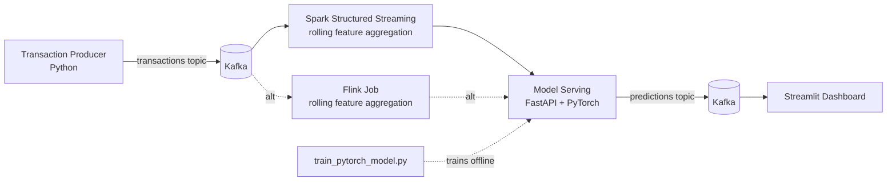

# Real-Time Fraud Detection Pipeline

An end-to-end streaming ML system: synthetic transactions flow through Kafka, 
get feature-engineered in Spark Structured Streaming (with a Flink
alternative), scored by a PyTorch model served via FastAPI, and visualized
live in a Streamlit dashboard. Infra is defined as code (Strimzi Kafka
operator + Terraform stub) so it can be deployed to AKS on demand.

## Architecture



## Why this project exists

This repo is deliberately structured to demonstrate the full lifecycle a
production ML system needs, not just a training notebook:

| Stage | Tool | What it proves |
|---|---|---|
| Ingestion | Kafka | Understanding of partitioning, consumer groups, backpressure |
| Stream processing | Spark Structured Streaming / Flink | Windowed feature aggregation at scale |
| Model | PyTorch | Ability to train + export a model for serving |
| Serving | FastAPI on AKS | Low-latency inference, containerized deployment |
| Orchestration | Kubernetes (Strimzi + Helm) | Ties back to existing AKS/K8s production experience |
| Observability | Streamlit dashboard | Making the system demoable, not just readable code |

## Repo layout

```
fraud-detection-pipeline/
├── producer/           # Kafka producer: simulates a transaction stream
├── model/              # PyTorch model definition + offline training script
├── consumer/           # Spark Structured Streaming job (features + scoring)
├── flink/              # PyFlink alternative to the Spark job
├── serving/            # FastAPI model-serving microservice + Dockerfile
├── dashboard/          # Streamlit live dashboard reading predictions
├── infra/
│   ├── k8s/             # Strimzi Kafka CRDs, deployment manifests
│   └── terraform/       # AKS cluster provisioning stub
└── data/                # Place the Kaggle creditcard.csv here (not committed)
```

## Local quickstart

1. **Spin up Kafka + Zookeeper + Redis locally:**
   

```bash
   docker-compose up -d
   ```

2. **Get training data:** download the [Kaggle Credit Card Fraud dataset](
   https://www.kaggle.com/mlg-ulb/creditcardfraud) and place `creditcard.csv`

   in `data/` . (284k transactions, 492 fraud cases — realistic class imbalance
   to reason about.)

3. **Train the model:**
   

```bash
   cd model && pip install -r requirements.txt --break-system-packages
   python train_pytorch_model.py
   ```

   This writes `model/fraud_model.pt` and `model/scaler.pkl` .

4. **Start the serving API:**
   

```bash
   cd serving && pip install -r requirements.txt --break-system-packages
   uvicorn app:app --host 0.0.0.0 --port 8000
   ```

5. **Start the streaming job** (pick one):
   

```bash
   # Spark
   cd consumer && pip install -r requirements.txt --break-system-packages
   spark-submit --packages org.apache.spark:spark-sql-kafka-0-10_2.12:3.5.0 spark_streaming_job.py

   # or Flink
   cd flink && pip install -r requirements.txt --break-system-packages
   python flink_job.py
   ```

6. **Produce synthetic transactions:**
   

```bash
   cd producer && pip install -r requirements.txt --break-system-packages
   python transaction_producer.py
   ```

7. **Watch live predictions:**
   

```bash
   cd dashboard && pip install -r requirements.txt --break-system-packages
   streamlit run streamlit_app.py
   ```

## Deploying to AKS

`infra/k8s/kafka-strimzi.yaml` deploys Kafka via the [Strimzi
operator](https://strimzi.io/) instead of a managed Kafka service, since it reuses Kubernetes
operator/CRD knowledge directly. `infra/terraform/main.tf` is a minimal stub
for provisioning the AKS cluster itself. Both are written to be spun up for a
demo and torn down afterward rather than run continuously, to avoid ongoing
costss.
